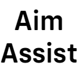

# Aim Assist

---

Aim Assist is free and open-source Minecraft mod which adds controller style aim assist like seen in games such as Fortnite and Apex Legends to Minecraft. Basically, whenever you are looking at a living entity such as a mob or player, your look sensitivity is slowed down making aiming at them easier.

---

## 📥 Installation

**This section still has to be written. Please check again at a later date.**